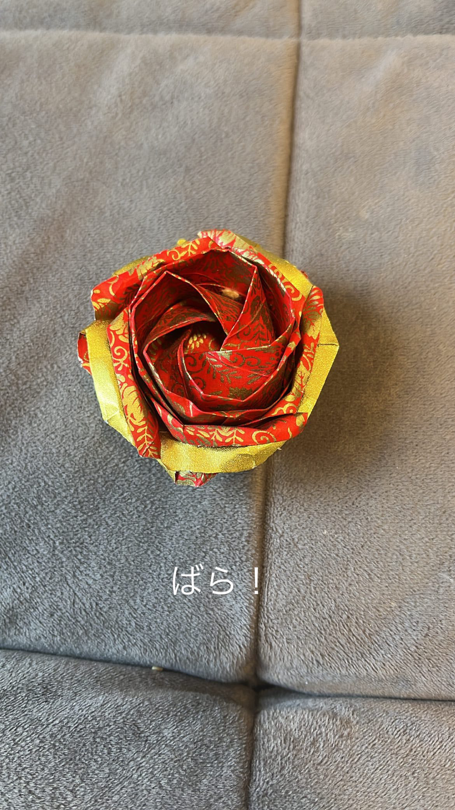
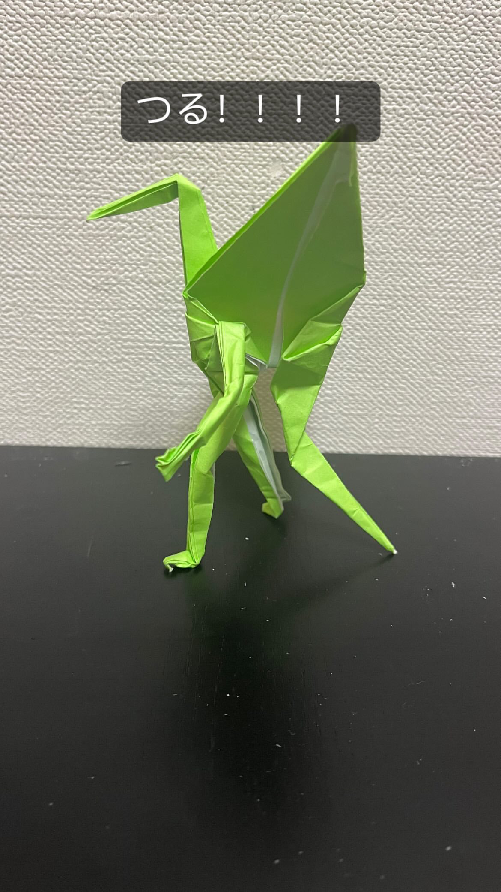
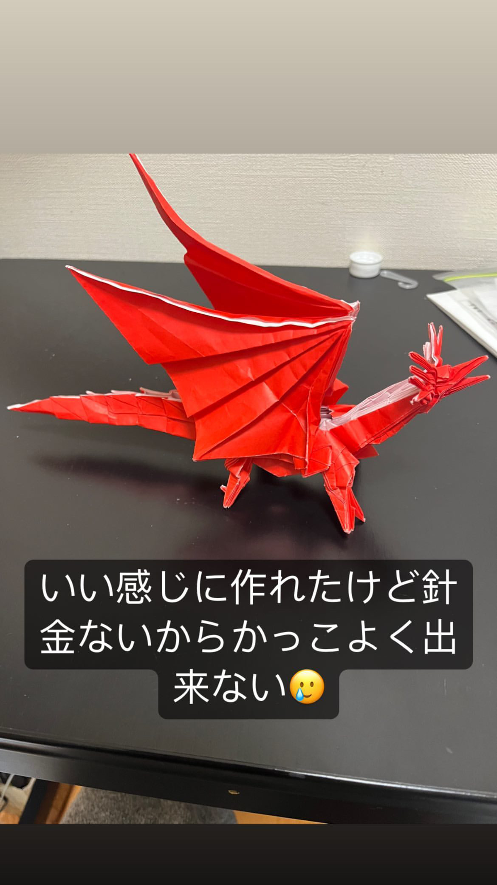

<!DOCTYPE html>
<html>
<head>
<title>HTML, CSS and JavaScript demo</title>
</head>
<body>
<!-- Start your code here -->

<h1>
    Daiki Matsumoto
</h1>

    私のこれまでの趣味の紹介をします

<h2 style="font-size: 17px;"">
    <i>折り紙</i>
</h2>

   
    はまっていた時期：小学六年生〜中学三年生 
    　　　　　　魅力：一枚の紙から複雑な形が出来上がるのが面白い 
    　　　　　　一言：それぞれの工程で紙をどのように動かせば次の図になるかと考えるので空間把握能力が上がります

<h2 style="font-size: 17px;"">
    <i>サッカー</i>
</h2>

    はまっていた時期：小学四年生〜中学三年生 
    　　　　　　魅力：広い芝生で独走する時の爽快感 
    　　　　　　一言：処理しなければいけない情報がめちゃくちゃ多くてすごく難しい競技でした。 
　　　　　　　　　中学で挫折

<h2 style="font-size: 17px;"">
    <i>将棋</i>
</h2>

はまっていた時期：小学6年生〜now 
　　　　　　魅力：未だ必勝手順が示されていない無限の可能性 
　　　　　　　　　頭脳戦で相手を負かす快感 
　　　　　　一言：勝つためにとんでもない勉強量が必要だし負けたらめちゃくちゃ悔しいしで 
　　　　　　　　　本気で取り組もうとしたらかなり根性を要する競技です。 
　　　　　　　　　<a href="https://shogiwars.heroz.jp/static/webgl/">ネット将棋</a>に暇な時間に取り組んでいます

<h2 style="font-size: 17px;"">
    <i>弓道</i>
</h2>

はまっていた時期：高校１年生〜高校３年生 
　　　　　　魅力：なんかかっこいい 
　　　　　　一言：正しい形がなぜ正しいとされるかが理解できずに部活引退と共に辞めました

<h2 style="font-size: 17px;"">
    <i>卓球</i>
</h2>

はまっていた時期：大学１年生〜now 
　　　　　　魅力：体格や筋力がなくても勝負できる 
　　　　　　一言：個人的に練習の成果が結果に現れやすく、これまでで自分に 
　　　　　　　　　一番向いている競技だと感じています。これまでになくはまっています
